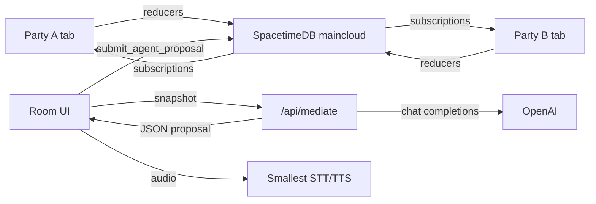

# Settle — shared negotiation table

For two parties who cannot agree, Settle turns the argument into a live term sheet
and an AI mediator that pushes them toward a deal. Built on
[SpacetimeDB](https://spacetimedb.com) (maincloud) with a mobile-first Next.js UI.

## Flow

1. **Create** a room — pick a category, title the dispute, name the two party labels,
   and seed the opening terms (`+ that`). You instantly become Party A with a short
   join code.
2. **Share the link** (or code) — the other party joins as Party B on their own device.
3. **Negotiate live** — both sides edit their positions and reasons; every keypress
   syncs in real time through SpacetimeDB subscriptions. Make offers, counter, accept,
   or reject. A gap meter shows how close both sides are.
4. **Ask the mediator** — a Next.js Route Handler sends the negotiation snapshot to
   OpenAI, which returns a structured deal proposal. The proposal lands back on both
   tabs via the `submit_agent_proposal` reducer; either side can accept or reject.
5. **Voice** — optional: speak a position into the mic (Smallest Pulse STT fills the
   field) and hear the mediator’s diagnosis aloud (Smallest Lightning TTS). Mediation
   reasoning stays in OpenAI; Smallest only does speech.

## Architecture



- **Source of truth:** SpacetimeDB tables (`negotiation`, `party`, `term`, `position`,
  `offer`, `offer_term`, `agent_proposal`, `event`, `presence`). Reducers are the only
  writers; clients read via subscriptions.
- **Env** (`.env.local` — AI keys live in `.env`, gitignored):

  ```bash
  SPACETIMEDB_DB_NAME=settle
  SPACETIMEDB_HOST=wss://maincloud.spacetimedb.com
  OPENAI_API_KEY=sk-...            # mediator brain (in .env)
  SMALLEST_API_KEY=...             # STT/TTS only (in .env)
  ```

## Develop

```bash
spacetime login                 # once, maincloud identity
npm install

npm run spacetime:generate      # regenerate client bindings from the module
npm run spacetime:publish       # publish the module to maincloud ("settle")

npm run dev                     # Next.js app on http://localhost:3000
```

Publishing wipes local-only data as needed; use `spacetime publish --delete-data=always`
only when a deliberate schema reset is required.

## Project layout

```
├── spacetimedb/src/index.ts    # SpacetimeDB module: tables + reducers
├── app/
│   ├── page.tsx                # landing: create room / join with code
│   ├── n/[code]/page.tsx       # room: term sheet, offers, mediator, presence
│   ├── api/
│   │   ├── mediate/route.ts    # OpenAI mediator (JSON proposal)
│   │   ├── stt/route.ts        # Smallest Pulse STT
│   │   └── tts/route.ts        # Smallest Lightning TTS
│   └── providers.tsx           # SpacetimeDB React provider + token persistence
├── lib/
│   ├── spacetimedb.ts          # maincloud URI / db name env helper
│   ├── smallest.ts             # server-side Smallest STT/TTS calls
│   └── voice.ts                # client-side mic recording + playback
└── src/module_bindings/        # auto-generated client bindings
```

## Two-tab demo path

1. Open `/` in tab A → create a room → copy the join link.
2. Open the link in an incognito tab → join as Party B.
3. Edit a position in tab A → it updates live in tab B (and vice versa).
4. Make an offer in one tab → accept/counter/reject from the other.
5. Ask the mediator → an OpenAI proposal appears on both tabs → accept to see the
   deal sheet.
6. Optional demo beat: speak your position (STT) and hear the proposal (TTS) in a
   different language via Smallest.
