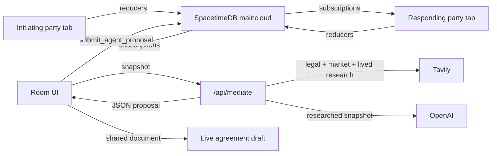

# Settle — shared negotiation table

For tenants and landlords who cannot agree, Settle turns a rental dispute into a
shared, researched negotiation workspace. Built on
[SpacetimeDB](https://spacetimedb.com) (maincloud) with a mobile-first Next.js UI.

## Flow

1. **Describe the rental** — provide the state, city, property type, matter title, and
   the situation in plain language. Settle can extract suggested rental terms for review.
   Confirm the opening terms and become the initiating party.
2. **Share the link** (or code) — the other party joins as the responding party on their own device.
3. **Negotiate live** — each party adds their context and opening positions. Opening
   values are preserved; later changes happen through proposals. Make offers, counter,
   accept, or reject. A gap meter shows how close both sides are.
4. **Ask the mediator** — Settle researches official Indian legal sources, current local
   market evidence, and lived rental experiences through Tavily before sending the
   snapshot to OpenAI. The response includes citations and can caution, block, or require
   human review instead of blindly proposing terms.
5. **Resolve and execute** — manual and mediator proposals are bilateral. Clauses are
   compared side by side like a merge conflict. Once both parties accept the terms and
   resolved clauses, Settle generates a PDF agreement.

## Architecture



- **Source of truth:** SpacetimeDB tables (`negotiation`, `party`, `term`, `position`,
  `offer`, `offer_term`, `agent_proposal`, `agreement_clause`, `event`, `presence`). Reducers are the only
  writers; clients read via subscriptions.
- **Env** (`.env.local` — AI keys live in `.env`, gitignored):

  ```bash
  SPACETIMEDB_DB_NAME=settle
  SPACETIMEDB_HOST=wss://maincloud.spacetimedb.com
   OPENAI_API_KEY=sk-...            # mediator brain (in .env)
   TAVILY_API_KEY=tvly-...          # external research (in .env)
  ```

## Develop

```bash
spacetime login                 # once, maincloud identity
npm install

npm run spacetime:generate      # regenerate client bindings from the module
npm run spacetime:publish       # publish the module to maincloud ("settle")

npm run dev                     # Next.js app on http://localhost:3000
```

Publishing wipes local-only data as needed; use `spacetime publish --delete-data=always`
only when a deliberate schema reset is required.

## Project layout

```
├── spacetimedb/src/index.ts    # SpacetimeDB module: tables + reducers
├── app/
│   ├── page.tsx                # landing: create room / join with code
│   ├── room/[code]/page.tsx    # room: term sheet, offers, mediator, presence
│   ├── api/
│   │   └── mediate/route.ts    # OpenAI mediator (JSON proposal)
│   └── providers.tsx           # SpacetimeDB React provider + token persistence
├── lib/
│   ├── spacetimedb.ts          # maincloud URI / db name env helper
└── src/module_bindings/        # auto-generated client bindings
```

## Two-tab demo path

1. Open `/` in tab A → create a room → copy the join link.
2. Open the link in an incognito tab → join as the responding party.
3. Add the responder's context and opening positions.
4. Make a proposal in one tab → accept/counter/reject from either side.
5. Ask the mediator → review its research decision and citations on both tabs.
6. Resolve clause differences, accept the latest terms from both tabs, and download the PDF.
